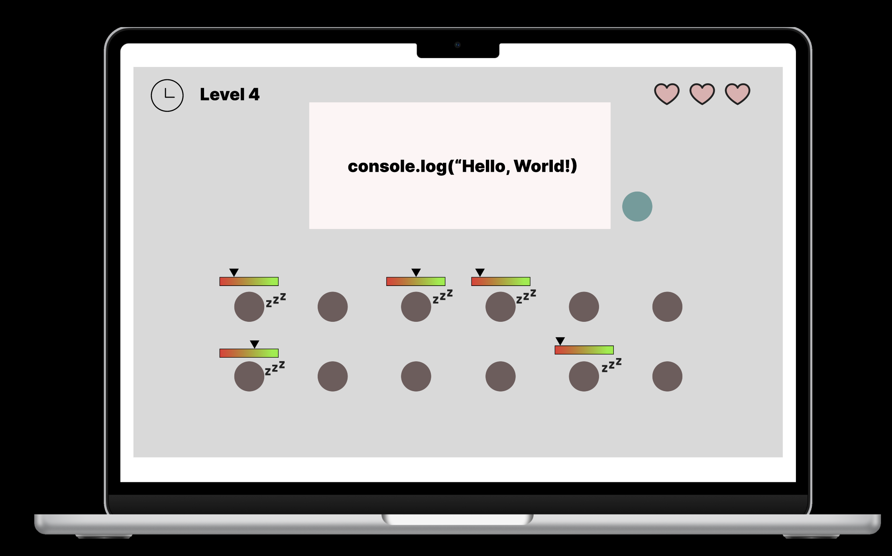

# Hey! Wake Up! 

## Background  
[Hey! Wake Up!](https://xlg123.github.io/Hey-Wake-Up-/) is a game that builds up on the concept of students taking a nap when the teachers have their backs against them. The game will have approximately 3 to 6 levels and the player will have 30 to 120 seconds to help the students wake up depending on the level they are playing. Each level will display 4 to 12 students and 1 teacher on the web page. Each student will have a energy level status showing how sleepy they are.

The game will require the player to keep clicking on the students that are falling asleep to give them more energy. After the timer is up, the teacher will turn his/her face around and looking for students that are sleeping. If a student's energy level status is below 50%, the player fails. To pass each level, the players must ensure all students have their energy above or equal to 50% when the timer ends.

## Functionality & MVPs  
With Hey! Wake Up!, players will have fun while:  
- Helping students to wake up in the classroom when the teacher turn his/her back against the students
- Competing with the timer to help as much students as possible
- Watching the students' images change from energetic to sleepy
- Challenging themselves with the impossible level 6

## Wireframes

[Figma Wireframe](https://www.figma.com/proto/2qE9LmP9WiDT8S0dl0k2zp/JSP-Game-Wireframe?page-id=0%3A1&type=design&node-id=120-205&viewport=-1512%2C-175%2C0.5&t=8VkJ8Yarj4JbQxU7-1&scaling=scale-down&starting-point-node-id=120%3A205&mode=design)(Actual game looks similar to the this wireframe)

## Technologies, Libraries, and APIs
This project will be implemented with the following technologies:  
`font-awesome`: Used font-awesome api to render icons  
`google-fonts`: Used google font api for creative fonts  

## Implementation Timeline
- __Friday Afternoon & Weekend__: Hosted project on GitHub Pages, finished implementing the Home Page and working on the Rules Page and Levels Page, applying CSS styling while implementation was in progress.
- __Tuesday__: 
- __Wednesday__: Deploy to GitHub pages and make sure the game renders correctly on both Windows and Mac, and on different browsers.
- __Thursday Morning__: Check if there is any bugs in the game, and if time allows, fix the bugs and rewrite README with the most updated information.

## Current Progress: 
- [x] General game layout in wireframe
- [x] General game layout on GitHub Pages
- [x] Setting up game home page
- [x] Setting up game rules page
- [x] Setting up first level
- [x] Setting up the remaining five levels

Core features Implemented:
- [x] Players can to go from home page to rules page
- [x] Players can to start the game from level 1 or choose any levels they want
- [x] Players can to click on the students to help them wake up within the time frame that is set by the timer for each level
- [x] Players can mute and unmute the background music of the game

Bonus features:
There are some exciting features that will be implemented in the future:
- [ ] Adding sound effects to every buttons in the game
- [ ] Players will be able to mute and unmute the sound effects of the buttons
- [ ] Players will be able to go from one level to another directly on the same page without going back to the home page
- [ ] Giving players the freedom to change the theme of the game and uploading images to represent the students and the teacher
- [ ] More levels will be added.  

To be updated daily